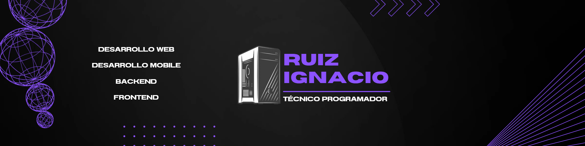

¡Hola! Soy Ignacio, un desarrollador **Full Stack** de Córdoba, Argentina.  
Actualmente estoy cursando el último año de la **Tecnicatura en Programación** en el [Instituto Técnico La Falda](https://latecnicalf.com.ar) 🏫.

Me especializo en crear aplicaciones escalables, funcionales y bien estructuradas, con experiencia en proyectos reales que abarcan desde startups hasta desarrollo institucional.

---

## 🚀 Experiencia

### 🧩 GOU (Startup propia) | Ene 2025 – Actualidad
**Fundador y Desarrollador Full Stack**  
- Desarrollo completo de una app de carpooling.
- Arquitectura, frontend y backend a cargo.
- **Tecnologías:** React Native, Angular, Laravel (API REST), SQL

### 🌐 [Web ITLF](https://latecnicalf.com.ar) | Ago 2024 – Sep 2024
**Desarrollador Full Stack**  
- Desarrollo del sitio institucional del Instituto Técnico La Falda.
- Fortalecimiento de habilidades en frontend y backend.
- **Tecnologías:** HTML5, CSS3, Bootstrap, JavaScript, PHP

---

## 🎓 Formación

**Técnico Programador**  
📍 Instituto Técnico La Falda – Cursando último año  
🔗 [latecnicalf.com.ar](https://latecnicalf.com.ar)

---

## 🌐 Contacto & Redes

- 📍 Córdoba, Argentina  
- 📞 +54 351 3709679
- 📧 ignacioguillermoruiz@gmail.com
- 📧 [LinkedIn](https://www.linkedin.com/in/ignacio-ruiz-0274a5297/)

---

> _"Transformando ideas en código desde la sierra hasta el servidor."_ 🔥
